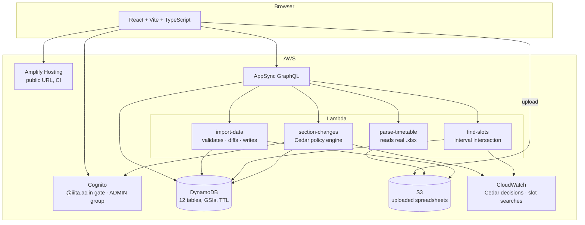

# Slate

**Your real timetable at IIIT Allahabad — including the class that just got cancelled.**

Live: **https://main.dosqfo1xoqa7l.amplifyapp.com**

> ### Sign in and look around, no registration
>
> Sign-up is restricted to `@iiita.ac.in` addresses, so four accounts are ready for you. Password for all of them: **`SlateDemo#2026`**
>
> | Sign in as | Password | What you see |
> |---|---|---|
> | `iit2024059@iiita.ac.in` | `SlateDemo#2026` | **Start here.** A real student's week, with an elective and a course taken with the junior batch |
> | `iit2024245@iiita.ac.in` | `SlateDemo#2026` | The same, plus **class representative** powers: cancel, move or add a class |
> | `iib2024001@iiita.ac.in` | `SlateDemo#2026` | A classmate in the same section whose week is different |
> | `demo-admin@iiita.ac.in` | `SlateDemo#2026` | The admin side: uploads, students, class reps, activity log |
>
> They are live accounts on real data, so a change made in one is visible in the others. That is the product.

Built for **First Commit** (WeMakeDevs × AWS), Sept 17–20, 2026. Ship It track.

---

## The problem

A timetable change here travels by WhatsApp. The professor tells the class representative, the CR forwards it to a group, and whoever muted that group turns up to an empty room. Worse, when a makeup class has to suit several sections and the professor, finding an hour that works takes a day of polls — even though every timetable involved already exists on paper.

And "the timetable" isn't one thing. A fifth-semester IT student takes core courses with their section, an elective with students from three other sections, and possibly a backlog course with the junior batch. No printed grid shows that student's actual week.

## What Slate does

| Who | What they get |
|---|---|
| **Any student** | Their own week — the courses they are actually registered in, including electives, minors and courses taken with another batch. Cancelled classes stay on the grid, struck through, naming who cancelled them. A live marker shows where you are in the day, and **Up next** names the next class, where it is, and how long you have. |
| **The class representative** (one per section, claimed in the app, admin can revoke) | Cancel a class on a date, add an extra class, move one, or shorten it ("runs 12:00–13:00 today instead of 11:00–13:00"). Every change carries their roll number. |
| **A CR planning a makeup class** | Pick the course; Slate finds the dated slots that are free for **every student registered in it** and for the professor, ranked with the reason spelled out, with a free room attached. When nothing fits, it names who blocks it and with what. |
| **Admin** | Upload the institute's own spreadsheets — timetables, per-year student lists, the registration list — review exactly what would change, and apply it. Manage CRs and see every change made across batches. |

Deliberately not built: voting or polls, chat, recurring changes, student-editable timetables.

## A two minute tour

1. Sign in as **`iit2024059`** and open **My courses**. Alongside their section's core courses there is an elective (**EF**) and a third-semester course (**SE**) taken with the junior batch. No printed timetable shows that.
2. Sign in as **`iit2024245`** in another window. This one is **Sec C's class representative**: click a class and cancel it on a date, or use **Make a change** to find a slot for a makeup class.
3. Go back to the first window and refresh. The change is on the grid, struck through, with the CR's roll number on it, and listed under **What changed**.
4. Sign in as **`demo-admin`** to see where the data comes from: **Upload Data** reads the institute's own spreadsheets, and **Activity** logs every change anyone made.

## How the data works

The institute's registration list says who takes what, from whom. The timetable sheets say when and where each professor teaches each course. Put together, they answer "what is *this student's* week?" exactly, with no section guesswork:

- **Offering** — one course as actually taught: one professor, one audience. IML in IT Sem 5 is *three* offerings, because Sections A, B and C each have their own professor.
- **Registration** — a student attends the offerings they're registered in. A drop-year student taking a junior batch's course is an ordinary case, not a special one.
- **Change** — always dated, always attached to an offering, so one cancellation reaches exactly the right students and nobody else.

`docs/DATA-MODEL.md` has the full design.

Currently loaded, all from real IIITA files: **1,801 students** across 8 batches, **104 offerings**, **246 class meetings**, **4,821 registrations**.

## Architecture



| Layer | Choice | Why |
|---|---|---|
| Hosting | Amplify Hosting | Public URL, deploys from a build artifact in seconds |
| Auth | Cognito, `@iiita.ac.in` gate via a preSignUp trigger, `ADMIN` group | The domain gate is the closed-community boundary; everyone else is a student |
| API + data | AppSync + DynamoDB (Amplify Gen 2) | Schema-generated CRUD, secondary indexes for the hot reads, TTL to expire old changes |
| Ingestion | S3 → `parse-timetable` → admin review → `import-data` | The real sheets are inconsistent; the admin confirms before anything is written |
| Slot finding | `find-slots` Lambda | Interval intersection across every registered student and the professor |
| Authorization | **Cedar** (`cedar-wasm`) inside `section-changes` | A real policy file decides who may change what; every decision is logged |
| Cost | — | Month-to-date spend is **$0.00**: everything is inside the free tier and scales to zero |

## Running it

```bash
cd slate
npm ci
npx ampx sandbox                       # deploys your own backend
npm run dev                            # http://localhost:5173
```

Deploy the frontend to Amplify Hosting: `scripts/deploy-frontend.sh`.

On a network behind a proxy (IIITA's is), prefix backend deploys:

```bash
NODE_OPTIONS="--require $PWD/scripts/force-proxy.cjs" npx ampx sandbox --once
```

Working with someone else on one backend: `docs/TEAM-SETUP.md`. Test checklist: `docs/TESTING.md`.

## Repo

- `slate/src/` — frontend. `StudentDashboard.tsx` (the week, changes, CR actions), `NewRequest.tsx` (finding a slot), `Admin*.tsx`, `components/TimetableGrid.tsx`
- `slate/amplify/data/resource.ts` — the schema
- `slate/amplify/functions/` — `parse-timetable`, `import-data`, `find-slots`, `section-changes` (with `policy.cedar`)
- `docs/` — data model, build plan, team setup, testing checklist
- `NOTES.md` — the build diary, including what didn't work

## Honest notes

- **Ingestion is spreadsheet-driven, not Textract.** The original plan was Textract + Bedrock over PDFs; the institute's timetables came as `.xlsx`, so reading them directly is both more accurate and cheaper. `slate/scripts/bedrock-normalize-timetable.py` is the Bedrock experiment, kept for honesty; it is not in the live path.
- **Registrations that match nothing are reported, never guessed.** About 2,100 rows (Environmental Studies, Art of Living and similar institute-wide courses) appear in no timetable sheet we hold, so those students see their other courses and nothing invented.
- **A CR's identity is their verified institute email**; their section comes from the admin-uploaded student list, never from anything they type.

## Credits

`CREDITS.md` lists every library, starter template and AI coding tool used.
